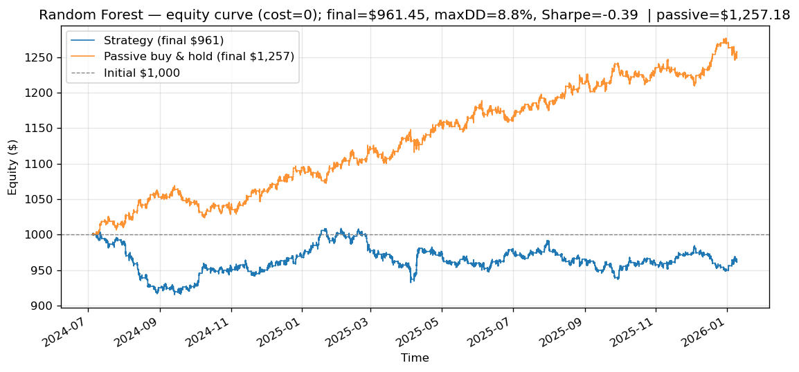

# Backtest — Strategy Equity Statistics

Long/short, fully-invested, compounding from the initial capital on the 50/50 time-ordered test set. Position is +1 (predict up) / -1 (predict down); per-bar return = (Close - Open) / Open; net return deducts the per-bar transaction cost. Risk-free rate = 0 for the Sharpe ratio.

## Random Forest

Periods: 275,759  |  2024-07-05T08:33 → 2026-01-09T16:00

| Metric | Value |
|--------|-------|
| Initial capital | $1,000.00 |
| Final equity | $961.45 |
| Total return | -3.85% |
| Max drawdown | 8.84% |
| Annualized Sharpe | -0.3939 |
| Transaction cost (per bar) | 0 |
| Bars / year | 182,033 |
| Passive final equity | $1,257.18 |
| Passive total return | 25.72% |
| Passive max drawdown | 4.26% |
| Passive Sharpe | 2.5018 |
| Strategy − Passive (return) | -29.57% |

