# Pipeline Module Diagram

End-to-end architecture of the Futures Price Direction Predictor.
Nodes are source files; edges show data flow.

```mermaid
flowchart TD

    %% ── Storage ────────────────────────────────────────────────────────────
    subgraph STORE["Storage"]
        RAW[("data/raw/data.csv\n551k minute bars")]
        PROC[("data/processed/\njoblibs / npz / parquet\ntraining_metadata.json")]
        DOCS[("docs/\nresults.md\nnotes/all_stats.md")]
        CFG_FILE[("config.yaml\ntrain_size / hyperparams")]
    end

    %% ── Configuration ──────────────────────────────────────────────────────
    subgraph CONFIG["Configuration"]
        CFG["src/config.py\nload_config\nmodel_params"]
    end

    %% ── Ingestion ──────────────────────────────────────────────────────────
    subgraph INGEST["Ingestion"]
        LOAD["src/load.py\nload_raw / validate"]
    end

    %% ── Feature Engineering ────────────────────────────────────────────────
    subgraph FEAT_ENG["Feature Engineering"]
        FEAT["src/features.py\nbuild_features\n20 lagged OHLCV features"]
        LABELS["src/labels.py\nbuild_labels\nClose gt Open = 1 else 0"]
    end

    %% ── Splitting ──────────────────────────────────────────────────────────
    subgraph SPLIT_BOX["Splitting"]
        SPLIT["src/split.py\nsplit\ntime-ordered / no shuffle"]
    end

    %% ── Models ─────────────────────────────────────────────────────────────
    subgraph MODELS["Models  src/models/"]
        BASE["baseline.py\nLogisticRegression"]
        RF["rf.py\nRandomForest\n500 trees / OOB"]
        GBM["gbm.py\nXGBClassifier\nlr=0.05 / depth=4"]
        SVM_M["svm.py\nSVC + StandardScaler\nRBF kernel"]
    end

    %% ── Evaluation ─────────────────────────────────────────────────────────
    subgraph EVAL_BOX["Evaluation"]
        STATS["src/statistics.py\ncompute\nStatsResult TypedDict\naccuracy / macro-F1 / MCC\nper-class P / R / F1"]
        EVALUATE["src/evaluate.py\naccuracy / recall\nconfusion / write_results"]
    end

    %% ── Orchestration ──────────────────────────────────────────────────────
    subgraph ORCH["Orchestration"]
        PIPE["src/pipeline.py\nrun\nload-or-train cache\nwrites metadata.json"]
        GUI["app.py\nStreamlit GUI\nTraining tab\nPrediction tab"]
    end

    %% ── Experiments ────────────────────────────────────────────────────────
    subgraph EXP["Experiments  src/experiments/  branch: exp/feature-engineering"]
        FEAT2["features_v2.py\nbuild_features_v2\n49 features incl MACD / RSI\nvol / tick-delta / ToD"]
        EXP_LBL["labels.py\nthree_class_labels\ngate_labels / direction_labels"]
        EXP_MET["metrics.py\nmcc / macro_f1\ncoverage / conditional_hit_rate\ngate_recall_debug"]
        EXP1["three_class.py\nExp 1: 3-class RF\nTimeSeriesSplit CV"]
        EXP2["two_stage.py\nExp 2: Gate then Direction RF\nthreshold tuning per fold"]
        EXP3["regime_two_stage.py\nExp 3: Gate then HMM then Direction RF\n2-state Gaussian HMM"]
        RUN_ALL["run_all_stats.py\nBatch stats for all 9 models\nskip-existing flag\nfeatures_v2 cache"]
    end

    %% ── Configuration edges ────────────────────────────────────────────────
    CFG_FILE --> CFG
    CFG --> PIPE
    CFG --> EXP1
    CFG --> EXP2
    CFG --> EXP3
    CFG --> RUN_ALL

    %% ── Production data flow ────────────────────────────────────────────────
    RAW --> LOAD
    LOAD --> FEAT
    LOAD --> LABELS
    FEAT --> SPLIT
    LABELS --> SPLIT

    SPLIT -->|X_train / y_train| BASE
    SPLIT -->|X_train / y_train| RF
    SPLIT -->|X_train / y_train| GBM
    SPLIT -->|X_train / y_train| SVM_M
    SPLIT -->|X_test / y_test| STATS
    SPLIT -->|X_test / y_test| EVALUATE

    %% ── Model storage and retrieval ─────────────────────────────────────────
    BASE -->|save joblib| PROC
    RF -->|save joblib| PROC
    GBM -->|save joblib| PROC
    SVM_M -->|save joblib| PROC
    PROC -->|load joblib| PIPE

    BASE -->|y_pred| STATS
    RF -->|y_pred| STATS
    GBM -->|y_pred| STATS
    SVM_M -->|y_pred| STATS

    STATS -->|StatsResult| DOCS
    EVALUATE -->|markdown| DOCS

    %% ── Orchestration edges ──────────────────────────────────────────────────
    PIPE -->|train / predict| BASE
    PIPE -->|train / predict| RF
    PIPE -->|train / predict| GBM
    PIPE -->|train / predict| SVM_M
    PIPE -->|writes| PROC
    GUI -->|calls run| PIPE
    GUI -->|reads config| CFG_FILE
    GUI -->|reads| PROC

    %% ── Experiment data flow ─────────────────────────────────────────────────
    LOAD --> FEAT2
    FEAT2 -->|49 features| EXP1
    FEAT2 -->|49 features| EXP2
    FEAT2 -->|49 features| EXP3
    LABELS --> EXP_LBL
    EXP_LBL --> EXP1
    EXP_LBL --> EXP2
    EXP_LBL --> EXP3
    EXP_MET --> EXP1
    EXP_MET --> EXP2
    EXP_MET --> EXP3

    EXP1 -->|y_true + y_pred npz| PROC
    EXP2 -->|y_true + y_pred npz| PROC
    EXP3 -->|y_true + y_pred npz| PROC
    EXP1 -->|last-fold joblib| PROC
    EXP2 -->|last-fold joblibs| PROC
    EXP3 -->|last-fold joblibs| PROC

    RUN_ALL --> EXP1
    RUN_ALL --> EXP2
    RUN_ALL --> EXP3
    PROC -->|load npz| RUN_ALL
    RUN_ALL -->|StatsResult| STATS
    STATS --> DOCS

    %% ── Styles ───────────────────────────────────────────────────────────────
    classDef store      fill:#254E70,stroke:#8EE3EF,color:#AEF3E7
    classDef cfg        fill:#37718E,stroke:#8EE3EF,color:#AEF3E7
    classDef model      fill:#37718E,stroke:#AEF3E7,color:#AEF3E7
    classDef eval       fill:#254E70,stroke:#AEF3E7,color:#AEF3E7
    classDef orch       fill:#7E4E60,stroke:#AEF3E7,color:#AEF3E7
    classDef experiment fill:#1a3a50,stroke:#8EE3EF,color:#8EE3EF

    class RAW,PROC,DOCS,CFG_FILE store
    class CFG cfg
    class BASE,RF,GBM,SVM_M model
    class STATS,EVALUATE eval
    class PIPE,GUI orch
    class FEAT2,EXP_LBL,EXP_MET,EXP1,EXP2,EXP3,RUN_ALL experiment
```

## Module inventory

| Module | File | Purpose |
|--------|------|---------|
| `load_raw`, `validate` | `src/load.py` | Parse raw CSV, validate schema |
| `split` | `src/split.py` | Time-ordered train/test split, configurable train_size |
| `build_features` | `src/features.py` | 20-dim lagged OHLCV feature matrix |
| `build_labels` | `src/labels.py` | Binary direction label (Close > Open) |
| `load_config`, `model_params` | `src/config.py` | Read config.yaml |
| `train`, `predict`, `save`, `load` | `src/models/baseline.py` | Logistic Regression |
| `train`, `predict`, `save`, `load` | `src/models/rf.py` | Random Forest, 500 trees, OOB score |
| `train`, `predict`, `save`, `load` | `src/models/gbm.py` | XGBoost classifier |
| `train`, `predict`, `save`, `load` | `src/models/svm.py` | SVC with training-fit StandardScaler |
| `run` | `src/pipeline.py` | End-to-end orchestrator with joblib caching |
| `compute`, `format_markdown`, `write_results` | `src/statistics.py` | Standardised StatsResult evaluation |
| `accuracy`, `recall`, `report` | `src/evaluate.py` | Legacy binary evaluation helpers |
| Training tab, Prediction tab | `app.py` | Streamlit GUI |
| `build_features_v2` | `src/experiments/features_v2.py` | 49-feature engineered matrix |
| `three_class_labels`, `gate_labels`, `direction_labels` | `src/experiments/labels.py` | Multi-label factories |
| `mcc`, `coverage`, `conditional_hit_rate` | `src/experiments/metrics.py` | Experiment-specific metrics |
| `run` | `src/experiments/three_class.py` | Exp 1: 3-class RF + TSS CV |
| `run` | `src/experiments/two_stage.py` | Exp 2: Gate + Direction RF cascade |
| `run` | `src/experiments/regime_two_stage.py` | Exp 3: Gate + HMM + per-regime Direction RF |
| `main` | `src/experiments/run_all_stats.py` | Batch stats for all 9 models |
